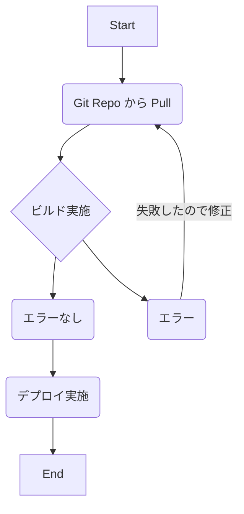
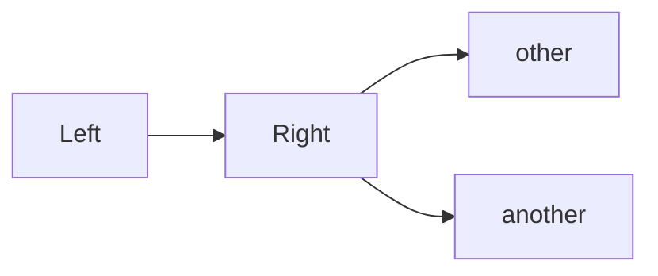
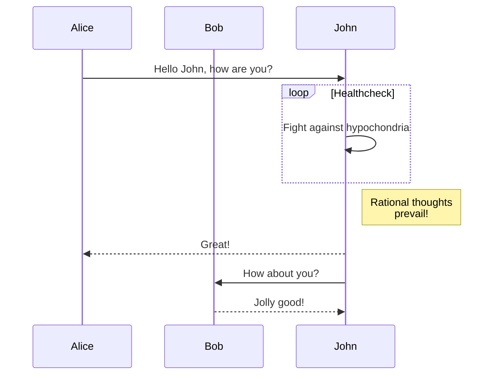
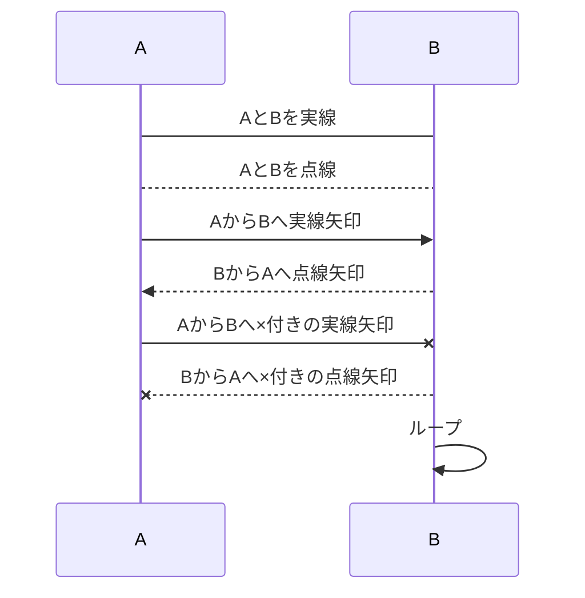
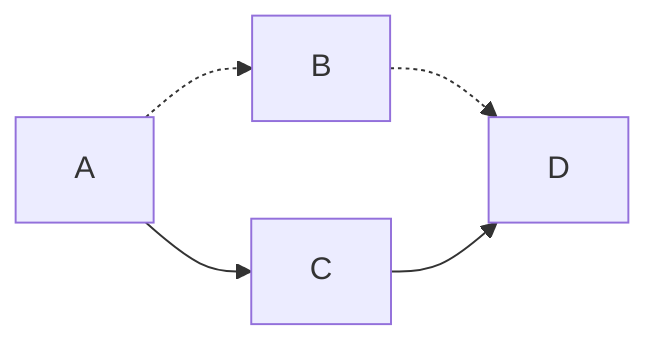
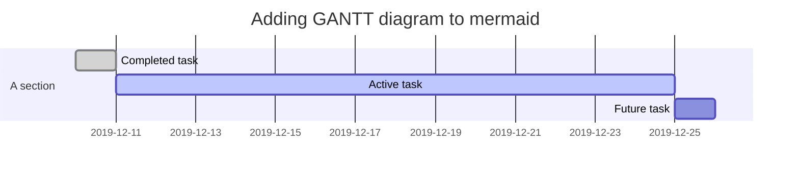

# h1としてのタイトル

## h2としてのタイトル

### h3としてのタイトル

#### h4の大きさ

何も指定なしに書いた地の文

##### h5の大きさ

###### h6の大きさ

囲った箇所を**強調する**ことができる  
囲った箇所を~~打ち消す~~ことができる  
囲った箇所を*斜体に*できる

html使えば文字色を指定できる  
<font color="Red">テキスト</font>  
Lintはとても怒ってくるが。

マークアップに空行は反映されない。  
唐突に水平線を入れてみる。↓
***

## 箇条書きは-でも*でもいいらしい

* 箇条書き１
* 箇条書き２
  * 箇条書き2-1
  * 箇条書き2-2

1. 数字つき箇条書き１
2. 数字つき箇条書き２
    * 2-1
    * 2-2

***

## 引用のような書き方

>誰々は
>こう言っていた。ここまでは改行はされていない。  
>これで改行される。改行するには文末に （半角空白スペース）を２つ。もしくは

１行空白行をつける。
>引用を  
>>ネストにすることもできる
***


## 画像を貼り付けたい場合はこれ

Format:   
  
htmlのimgタグでも指定できる。  
  
でも、めちゃLintは怒ってくる。
***


## リンクを貼りたい場合はこれ

[GitHub](http://github.com)

***

## バックスラッシュエスケープは通常通り有効

\*literal asterisks\*

## インライン表示

例えば`print('sample')`のように書くのかな？

***

## コード挿入

```python
def sample_func(sample):
    for item in sample:
        print(item)
```

***

## 表はこれで作るらしい。ガチ編集しづらい

First Header | Second Header
------------ | -------------
Content cell 1 | Content cell 2
Content column 1 | Content column 2


***

## タスク的な書き方ができる

* [x] 完了したこと
* [ ] 完了してないやつ

***

## マーメイドの機能













